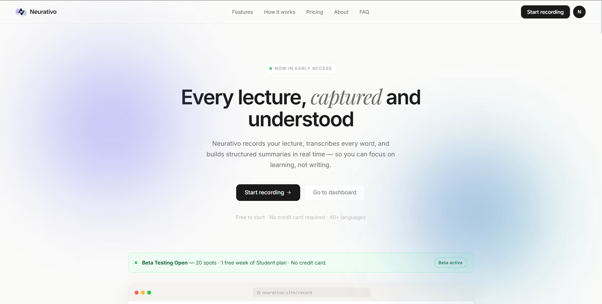
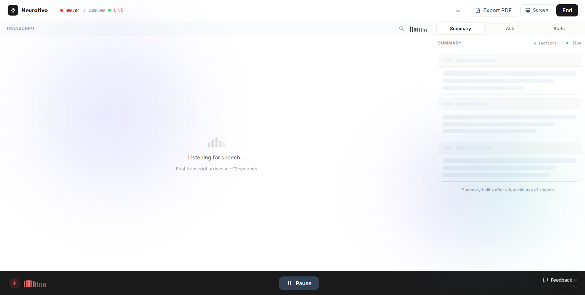
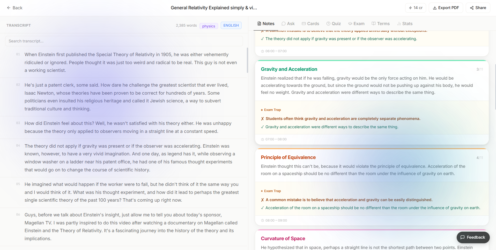
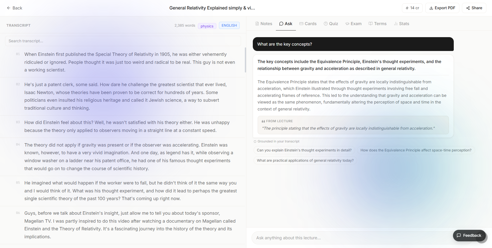
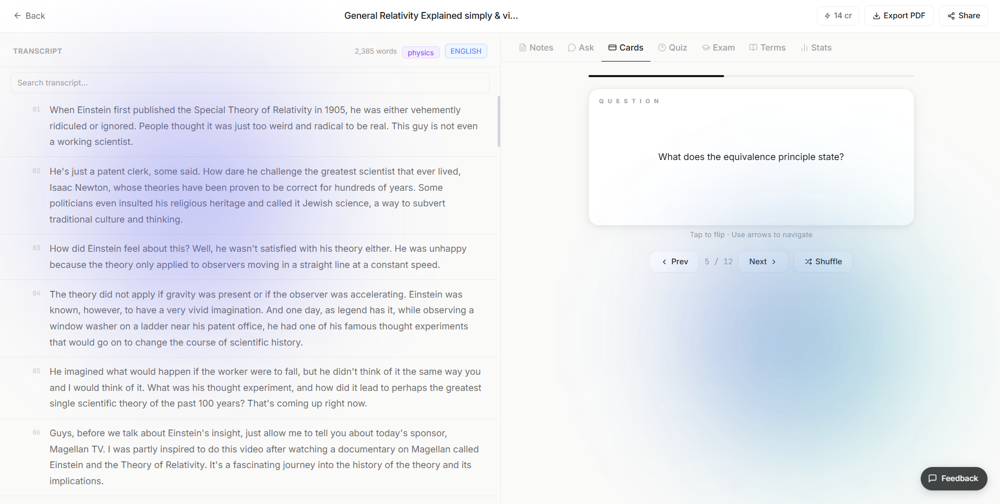
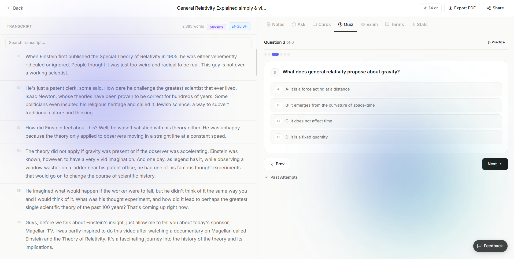
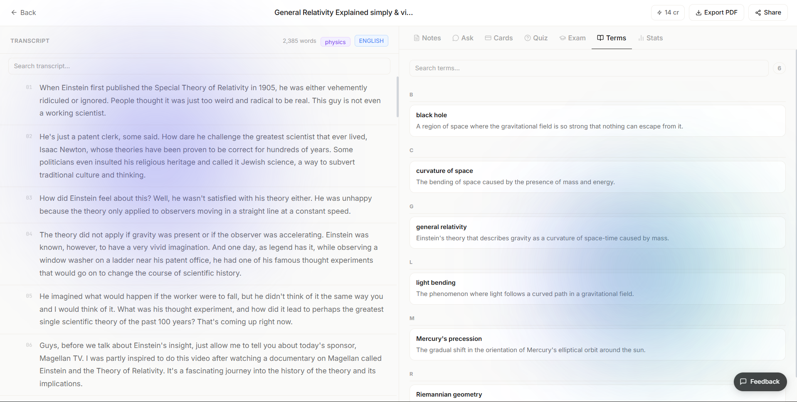

<div align="center">
  

  <h1>Neurativo</h1>
  <h3>AI-Powered Learning Platform</h3>

  <p>
    Record a lecture and turn it into structured notes, flashcards, quizzes,<br />
    and lecture-based Q&amp;A.
  </p>

  <p>
    <a href="https://www.neurativo.site"><strong>Live Demo</strong></a>
  </p>

  <p>
    
    
    
    
    
  </p>
</div>

---

## About

Neurativo is a learning platform built to help students get more out of their lectures.

Users can record or upload a lecture, generate a transcript and structured notes, then use that lecture to create study materials and ask questions.

This is a practical full-stack project covering AI-powered apps, web development, and backend systems.

> **Development note:** Neurativo was developed using AI-assisted coding, then tested, debugged, and refined by hand.

---

## Features

| | |
| --- | --- |
| **Lecture recording** | Record from the browser (microphone or a tab). |
| **Lecture import** | Upload an existing audio or video file. |
| **Transcription** | Speech-to-text with Whisper. |
| **Structured notes** | Organised notes generated from the lecture. |
| **Lecture Q&A** | Ask questions grounded in that lecture, not generic answers. |
| **Flashcards** | Study cards built from the same material. |
| **Quizzes** | Multiple-choice and short-answer checks. |
| **Exam prep** | Extra revision questions from the lecture. |
| **PDF export** | Download notes as a PDF. |
| **Auth** | Sign-in with Clerk. |

---

## Screenshots

<p align="center">
  
</p>
<p align="center"><em>Landing page</em></p>

<p align="center">
  
</p>
<p align="center"><em>Live recording</em></p>

<p align="center">
  
</p>
<p align="center"><em>Structured notes</em></p>

<p align="center">
  
</p>
<p align="center"><em>Lecture Q&amp;A</em></p>

<p align="center">
  
</p>
<p align="center"><em>Flashcards</em></p>

<p align="center">
  
</p>
<p align="center"><em>Quiz</em></p>

<p align="center">
  
</p>
<p align="center"><em>Glossary</em></p>

---

## How it works

```text
Record or upload a lecture
            ↓
       Transcription
            ↓
   Lecture content is processed
            ↓
       Structured notes
            ↓
     ┌──────┼──────┐
     ↓      ↓      ↓
    Q&A  Cards  Quizzes
```

---

## Tech stack

| Area | Technology |
| --- | --- |
| Frontend | React, Vite, Tailwind CSS |
| Backend | Python, FastAPI |
| Database | Supabase / PostgreSQL |
| Authentication | Clerk |
| AI | OpenAI Whisper + GPT |
| Frontend hosting | Vercel |
| Backend hosting | Railway |

---

## Project structure

```text
neurativo/
├── frontend/     # React app (Vercel)
├── backend/      # FastAPI API (Railway)
├── emails/       # Transactional email templates
└── docs/         # Specs and notes
```

---

## Running locally

API keys are **not** in this repo. Copy the example env files and fill in your own.

**Frontend**

```bash
cd frontend
npm install
copy .env.example .env.local
npm run dev
```

**Backend**

```bash
cd backend
python -m venv venv
.\venv\Scripts\activate
pip install -r requirements.txt
copy .env.example .env
uvicorn app.main:app --reload --port 8000
```

---

## Project status

Neurativo is an ongoing project. Features and improvements may still be added.

---

## Author

**Shazad Arshad**  
Aspiring software developer. Interested in Python, web development, AI, and building things people can actually use.

- LinkedIn: [linkedin.com/in/shazadarshad](https://linkedin.com/in/shazadarshad)
- Email: [shazad.arshad189@gmail.com](mailto:shazad.arshad189@gmail.com)
