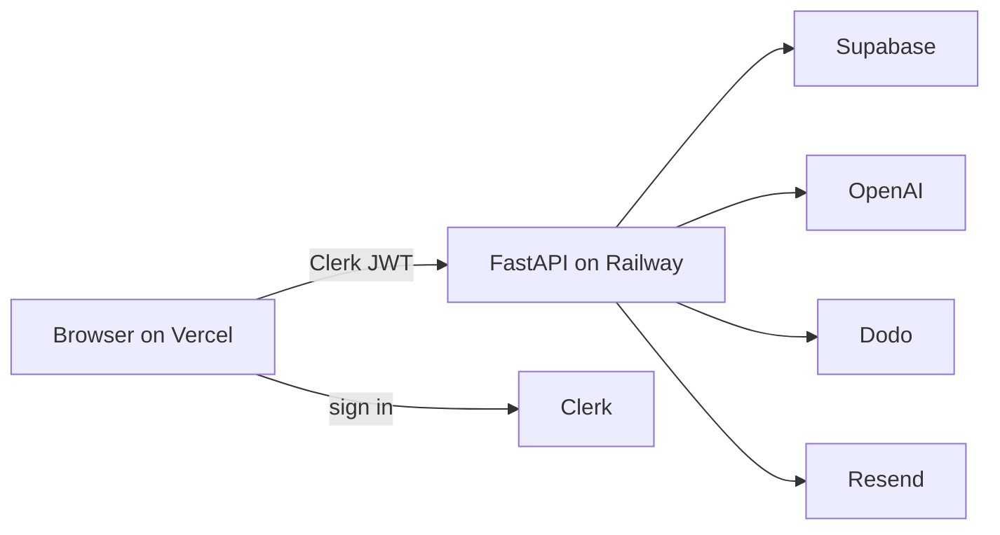

<div align="center">
  
  <h1>Neurativo</h1>
  <p>
    Record a lecture. Walk out with notes, flashcards, a quiz,<br />
    and a Q&amp;A that only answers from <em>that</em> class.
  </p>
  <p>
    <a href="https://neurativo.vercel.app"><strong>neurativo.vercel.app</strong></a>
    &nbsp;·&nbsp;
    <a href="https://neurativo.vercel.app/features">Features</a>
    &nbsp;·&nbsp;
    <a href="https://neurativo.vercel.app/pricing">Pricing</a>
    &nbsp;·&nbsp;
    <a href="https://neurativo.vercel.app/faq">FAQ</a>
  </p>
  <p>
    
    
    
    
    
  </p>
</div>

<br />

<p align="center">
  
</p>

I built Neurativo as a real product, not a tutorial app. Students record (or upload) a lecture; the backend transcribes it with Whisper, writes structured notes, and generates study tools. Auth, billing, credits, and an admin panel are all in here.

The public site for this repo is **[neurativo.vercel.app](https://neurativo.vercel.app)**. Sign-in is live Clerk. The API is the live FastAPI service.

---

## What you can do on the site

<table>
<tr>
<td width="50%" valign="top">

**As a student**

- Sign in / sign up
- Record live (mic or a browser tab)
- Import an audio / video file
- Read the transcript + notes
- Ask questions grounded in the lecture
- Flip flashcards, take a quiz, run exam prep
- Export a PDF, share a public link
- Buy credits or upgrade plan

</td>
<td width="50%" valign="top">

**Under the hood**

- Clerk JWT on every API call
- 1 credit = 30 minutes of audio
- Free / Student ($9.99) / Pro ($19.99)
- Import job progress (Whisper → notes)
- Admin: users, costs, billing, flags
- Teams orgs (invites, seats)
- Transactional email (Resend)

</td>
</tr>
</table>

Try it in this order: [landing](https://neurativo.vercel.app) → Sign in → **New lecture** or open one from the dashboard → tabs on the right (Notes, Ask, Cards, Quiz, Exam).

---

## How a lecture actually moves through the app

```
Student hits Record
        │
        ▼
  POST /api/v1/live/start     ← checks credits + plan limits
        │
        ▼
  ~12s audio chunks  ──────►  Whisper  ──────►  transcript
        │                         │
        │                         ▼
        │                   drop off-topic audio
        │                   build notes as it goes
        ▼
  POST /api/v1/live/end       ← settle credits, final summary
        │
        ▼
  /lecture/:id
     Notes · Ask · Cards · Quiz · Exam · Terms · Stats
```

File import is the same idea, just async: compress → transcribe → clean → generate → save. The dashboard polls `/api/v1/jobs/:id` so you can close the tab after upload.

---

## Stack

| Layer | What |
| --- | --- |
| Frontend | Vite, React 18, Tailwind, Clerk, Axios — hosted on **Vercel** |
| Backend | FastAPI, Uvicorn — hosted on **Railway** (Docker: ffmpeg + Playwright) |
| Auth | Clerk (hosted sign-in at `accounts.neurativo.com`, returns here) |
| Database | Supabase (Postgres). User ids are Clerk ids, not Supabase Auth |
| Models | OpenAI Whisper for speech, GPT for notes / Q&A / study tools |
| Billing | Dodo Payments (subscriptions + credit packs) |
| Email | React Email templates → Resend |
| PDFs | Jinja template + Playwright Chromium |

The browser never talks to Supabase. It talks to FastAPI with a Clerk bearer token.



---

## Repo layout

```
frontend/     Vite app          → Vercel  (root directory: frontend)
backend/      FastAPI           → Railway (root directory: backend)
emails/       React Email
docs/         feature specs + implementation notes
```

Useful entry points if you are reading the code:

- `frontend/src/main.jsx` — routes
- `frontend/src/App.jsx` — live recorder
- `frontend/src/pages/LectureView.jsx` — lecture workspace
- `backend/app/main.py` — API mount
- `backend/app/api/endpoints.py` — live + import + study tools
- `backend/app/core/plans.py` — plan limits and prices

---

## Run locally

Nothing secret is in this repo. You need your own keys.

**Frontend**

```bash
cd frontend
npm install
copy .env.example .env.local
# put your Clerk publishable key in .env.local
npm run dev
```

Leave `VITE_API_URL` unset to hit the live API, or point it at `http://127.0.0.1:8000` if you start the backend.

**Backend** (only if you want the API on your machine)

```bash
cd backend
python -m venv venv
.\venv\Scripts\activate
pip install -r requirements.txt
copy .env.example .env
uvicorn app.main:app --reload --port 8000
```

Docker image is `backend/Dockerfile` (ffmpeg + Chromium, port 8080).

---

## Deploy notes

This copy is wired for **https://neurativo.vercel.app**, not neurativo.com.

| Host | Root directory | Env that has to exist |
| --- | --- | --- |
| Vercel | `frontend` | `VITE_CLERK_PUBLISHABLE_KEY` |
| Railway | `backend` | Clerk JWKS, OpenAI, Supabase, plus Dodo/Resend if you want billing/email |

For sign-in to return to this host, Clerk must allow `https://neurativo.vercel.app` as an origin and redirect URL. The API CORS list must include that origin too (`ALLOWED_ORIGINS`).

---

## What is not in git (on purpose)

| Kept out | Why |
| --- | --- |
| `.env` / `.env.local` | API keys, Clerk secret, Dodo, Resend |
| `node_modules/`, `venv/` | install from lockfiles |
| Real Clerk / OpenAI / Supabase values | they live on Vercel and Railway only |

`.env.example` files are placeholders. If a scanner flags `pk_live_xxx` in the example, that is a dummy string.

---

## Tests

```bash
cd backend
python -m pytest tests/ -q
```

Coverage is strongest around notes generation, credits, billing gates, and PDF helpers — not a full HTTP suite against Clerk.

---

Built by [Shazad Arshad](mailto:hello@neurativo.com) and Shariff Ahamed. Source here is for reading and for this Vercel deploy. See `LICENSE`.
